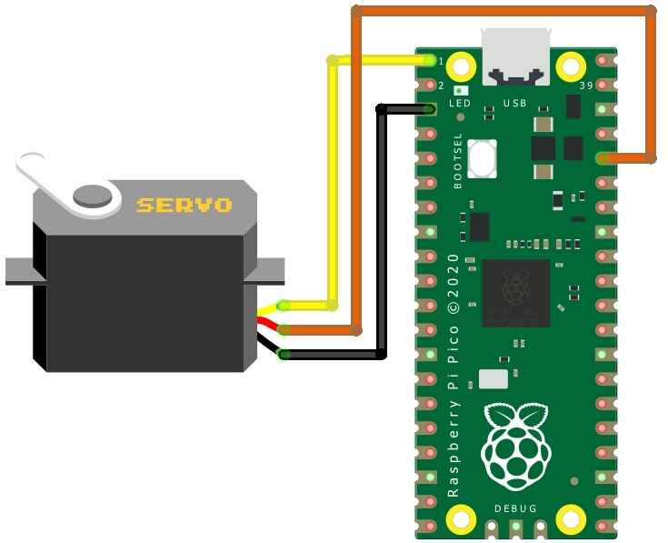

# doorman, the apartment buzzer bot

Like many other programmers, I like to think of app ideas that I can bring to life with software. For a while, I was fixated on trying to build the "next big thing" which everyone (and their mothers) would use, but kept coming up short for some reason! So, I reassessed and decided that maybe the best way to reach my goal would be to start small - what problems in my everyday life can I solve or make easier with technology? Using this strategy, I recently came up with MY killer app.

Sometimes, I forget things. Hey don't we all? How many times have you found yourself locked out of your home or apartment because you forgot your keys? It happens. Oftentimes I forget my keys because I mean, there are so many other things to think about besides making sure I have everything before leaving my apartment. Nevertheless, I always have my phone. After many times of being locked out, it suddenly hit me. Can I use technology to overcome my negligence? Could I use my phone as a key?

In my apartment, there is a door buzzer to unlock the outer door so that visitors (or ourselves) can get in without a key. It looks like this:

Whenever I get locked out, I usually buzz in from downstairs and hopefully one of my roommates is there to buzz me in. If not, I'm SOL until one of them gets home or I obtain one of their keys. But what if there was a way to buzz myself in remotely so I don't have to do either? Enter Doorman.

This is my _rough_ back of the napkin architecture drawing from when I first got the idea. I had already bought a Raspberry Pi Pico W (Pi) a while back hoping that having one would eventually give me inspiration to build something. The Pi comes with an onboard wifi chip to allow it to connect to the internet. Considering this, my thought was that since the Raspberry Pi can also interact with the real world through its pins, I could make an API call to a webserver running on the Pi that triggers some sort of lever to push the door buzz button for me.

I found these little servomotors [on Amazon](https://www.amazon.com/gp/product/B09G9YLKY3/ref=ppx_yo_dt_b_asin_image_o07_s00?ie=UTF8&psc=1) which looked perfect for pressing the button. Then I learned how to use MicroPython, a version of Python that can run on microcontrollers, to write a simple web server that lights up an LED when a GET request is made to a custom endpoint (tutorial [here](https://www.raspberrypi.com/news/how-to-run-a-webserver-on-raspberry-pi-pico-w/)).

Then, I hooked up the servo to the Pi using a breadboard and found out how to move its arm to the correct angle and back, which would imitate the button press, and stuck that routine into the webserver code in place of the LED blink. Finally, I tested it out to make sure the lever moved correctly when I hit the endpoint.

Now all there was to do was stick it on the buzzer and test it out!

IT WORKED!!!

But not quite, it was still a little weird that we'd have to hit an API endpoint to get our door open. What about making it a text to a phone number? That way, it can be more mobile friendly without requiring an app, and we can even share it with all our friends and acquaintences 😉. I made a free account on [Twilio](https://www.twilio.com/try-twilio) and created a new phone number to use for the door. Then I set up a webhook to make a GET request to my endpoint whenever a text is sent to that number. Simple as that.

I also replaced the battery pack power source to use the wall outlet because it would run out after a short while.

This all worked nicely, but for some reason the web server kept failing to receive connections after some amount of time being online. This meant when I fully trusted Doorman and left my house without my keys, I could be back to square one - locked out. Ideally, this thing should have 100% availability to account for the edge case scenario that everyone is out and we all left our keys at home (this has happened more than once).

I did some digging, and I could not find exactly why this was happening. I thought it could be that the Raspberry Pi was running out of memory after a certain amount of requests, so I put some statements in to manually perform garbage collection after each request. Still no luck. As a hacky solution, I bought a wifi smart plug that exposes endpoints to turn itself on and off. Next, I spun up a EC2 instance on AWS (free tier) and set up a cron job to run a script that pings the Pi's webserver every minute and turns the smart plug on and off if the health check returns anything other than a 200 status. This has worked great, so I'll probably just keep this implementation until something stops working. However, I am still really curious what the root cause is, so if anyone knows what I am doing wrong please feel free to reach out!

Along with making my roommates and I feel like the cast in the movie Smart House, Doorman has been an extremely fun project to work on. It also taught me valuable lessons about the engineering and design process, how to program a Raspberry Pi, how to solder, and what the hell a [servo](https://en.wikipedia.org/wiki/Servomotor) is. Sometimes it's better to think smaller, you will be surprised at how much you learn in the process of building a seemingly insignificant project.

Bonus:

To make Doorman look prettier and get my breadboard back, I figured I could hide the Pi and the wiring behind the buzzer panel. This turned out to be difficult with the microusb not being able to fit through the screw hole of the panel, so I decided to cut the cord and splice the wires back together on the other side of the panel.

Much better, and now with a little more attitude 😈